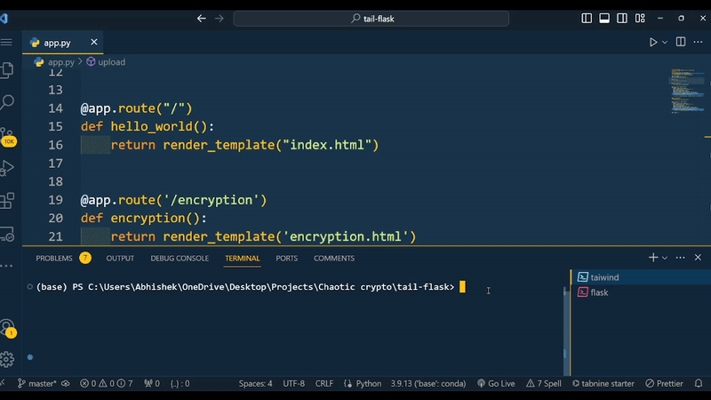

# Chaotic Crypto


<p align="center">
            
        </p>

Welcome to Chaotic Crypto, a web app developed as a course project for the IT352 Information Assurance and Security course at NITK Surathkal. This academic project explores innovative techniques in image encryption based on the paper "Efficient and Secure Chaotic PRNG for Color Image Encryption" by Mohammed M. Al-Mhadawi, Ekhlas Abbas Albahrani, and Sadeq H. Lafta.

## Acknowledgment

This project is built upon the academic research presented in the paper "Efficient and Secure Chaotic PRNG for Color Image Encryption" by Mohammed M. Al-Mhadawi, Ekhlas Abbas Albahrani, and Sadeq H. Lafta. We express our gratitude for their valuable contribution to the field, which has inspired and guided our academic work.

## Table of Contents

- Overview
- Features
- Getting Started
- Usage
- Walkthrough
- Implementation Details
- Web App
- Contributors


## Overview

Chaotic Crypto is a course project focusing on the implementation of a novel chaotic pseudorandom number generator (PRNG) for secure image encryption. The methodology is based on the paper mentioned above and is developed as part of the IT352 Information Assurance and Security course.

## Features

- *Chaotic PRNG:* Unique combination of three chaotic maps for generating secure random sequences.
- *Image Encryption/Decryption:* A powerful image cipher system leveraging the chaotic PRNG for academic exploration.
- *Web App Interface:* A user-friendly web app built with Flask, providing an intuitive interface for experimenting with image encryption techniques.

## Getting Started

These instructions will get you a copy of the project up and running on your local machine for development and testing purposes.

### Prerequisites

- Python 3.8 or higher
- Node.js and npm

### Installation

1. Clone the repository:
    ```bash
    git clone https://github.com/Tech-Savvy-Abhishek/Chaotic_Crypto.git
    ```
2. Navigate to the project directory:
    ```bash
    cd Chaotic_Crypto
    ```
3. Install Python dependencies:
    ```bash
    pip install -r requirements.txt
    ```
4. Install JavaScript dependencies:
    ```bash
    npm install
    ```

### Running the Application

You will need to run the Flask server and the Tailwind CSS compiler at the same time:

1. Run the Flask server:
    ```bash
    flask run
    ```
2. In a new terminal, run the Tailwind CSS compiler:
    ```bash
    npm run tailwind
    ```

<p align="center">
            
        </p>

Now, both the Flask server and the Tailwind CSS compiler should be running simultaneously. Open your web browser and navigate to http://localhost:5000 to view the application.

## Usage

1. Upload a true-color image (24-bit depth) to the web app.
2. Experiment with encryption and decryption techniques as part of your academic exploration.

## Walkthrough

Below is a brief walkthrough of our application:

<p align="center">
            
        </p>


## Implementation Details

The core of Chaotic Crypto lies in the implementation of the proposed chaotic PRNG. The method involves floating-point initial values, SHA-2(256) hashing, and a series of operations on three chaotic maps. The encryption/decryption process follows a meticulous sequence, ensuring both academic rigor and exploration.

## Web App

Chaotic Crypto features a sleek and interactive web app built with Flask. The app provides an academic platform for experimenting with image encryption and decryption techniques.

## Contributors

- [Abhishek](https://github.com/Tech-Savvy-Abhishek)
- [Kirubakaran M G
](https://github.com/Kiruba061003)
- [Aayush Deshmukh](https://github.com/TheUndercover01)

Contributions from the members of the IT352 Information Assurance and Security course at NITK Surathkal have been instrumental in bringing this academic project to fruition.

